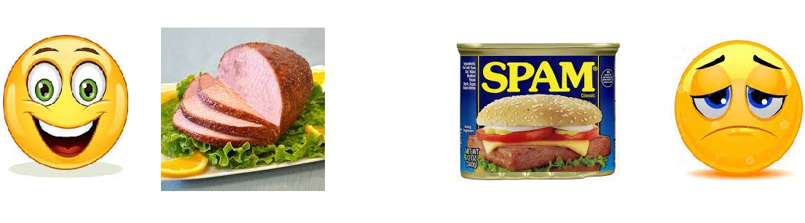

# Building a Spam Filter with Naive Bayes

## Project Description

The goal of this project is to build a tool to classify text messages as spam or not spam. We do this by implementing from the ground up the multinomial naive Bayes algorithm (with Laplace smoothing). This means that, rather than fitting an instance of the `MultinomialNB()` class contained in the `sklearn.naive_bayes` module, we bother to go through all the steps of the algorithm and to explicitly compute all the constants and parameters it requires.

The silver lining of this approach is that, by the time the reader has gone over the entire notebook, it will have a clear understanding of how the multinomial naive Bayes algorithm actually works, the math and probability theory that lies behind it and how all this can be used concretely to classify text messages.       

## About the Data

In order to train and test the naive Bayes classifier we intend to build, we use a dataset of 5,572 SMS that have already been classified by humans. This dataset was put together by Tiago A. Almeida and José María Gómez Hidalgo and is publicly hosted by the [UCI Machine Learning repository](https://archive.ics.uci.edu/ml/datasets/sms+spam+collection). On this page the reader can find more information about the criteria used to collect this corpus of texts together with references to some of the authors' papers where this data has been used.

## Outline of the Notebook

The following is a detailed outline of the notebook and the steps we take to obtain the spam filter which classifies whether a given message is spam or not spam:

1. We give a quick overview of how the naive Bayes algorithm works and what kind of information it uses;
2. We divide the dataset of text messages into a training and test set;
3. In order to make the algorithm run more smoothly, we clean the SMS in the training set;
4. We find the vocabulary of words that appear in the texts contained in the training set;
5. We use these words to add columns to the training data and through these new columns we calculate the constants one needs to run the naive Bayes algorithm (we also set a Laplace smoothing parameter $\alpha = 1$ to avoid getting zero probabilities);
6. We compute the remaining necessary parameters and implement the spam filter by defining a function which takes as input a message and returns its classification label: either spam or not spam;
7. We apply this function to the test set and observe an accuracy of 99.282%.